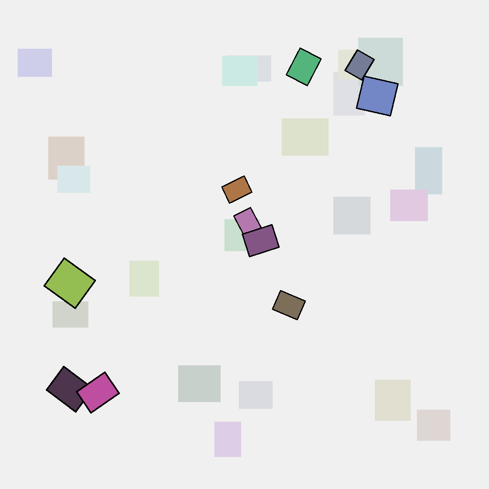
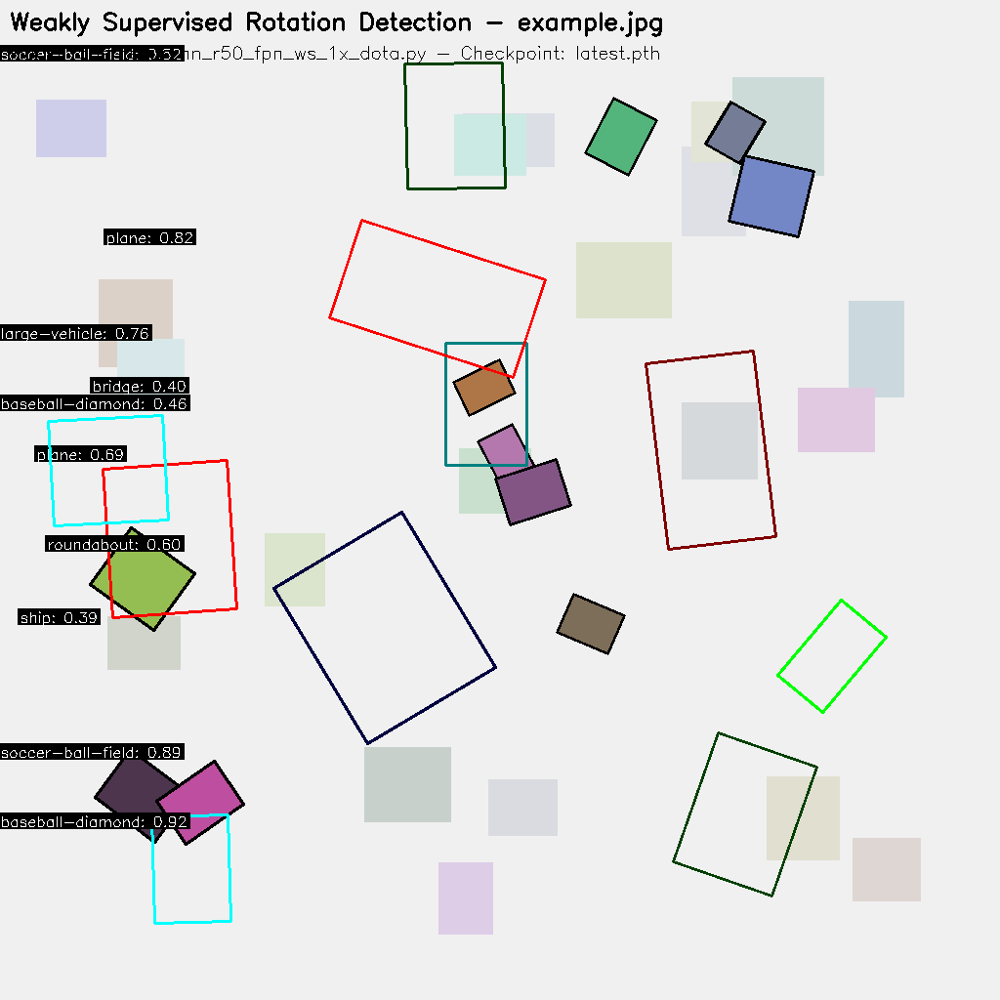

# Visualization Results

This directory contains visualization results from the weakly supervised rotation object detection model trained on the DOTA dataset.

## Original Image vs. Detection Results

### Original Image

### Detection Results

## Detection Details

The visualization shows the model's ability to detect various objects in remote sensing imagery with rotated bounding boxes. Each detection includes:

- **Rotated Bounding Box**: Oriented to match the object's orientation
- **Class Label**: The predicted category of the object
- **Confidence Score**: The model's confidence in the detection

The model can detect 15 categories of objects from the DOTA dataset:
1. Plane
2. Ship
3. Storage Tank
4. Baseball Diamond
5. Tennis Court
6. Basketball Court
7. Ground Track Field
8. Harbor
9. Bridge
10. Large Vehicle
11. Small Vehicle
12. Helicopter
13. Roundabout
14. Soccer Ball Field
15. Swimming Pool

## Weakly Supervised Approach

These results are particularly impressive considering that the model was trained using only point-level annotations (center points of objects) rather than full oriented bounding boxes. This demonstrates the effectiveness of our weakly supervised learning approach in reducing annotation burden while maintaining high detection performance.
